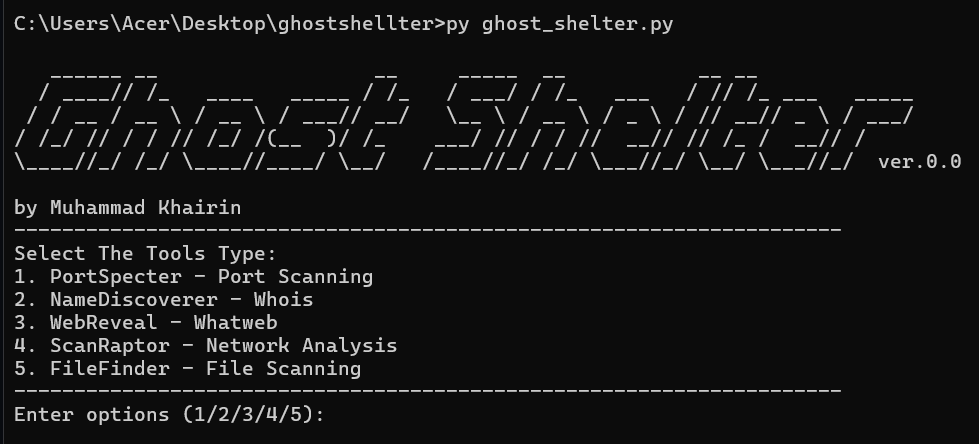

# Ghostshelter - NetworkTool


A network scanning and analysis tool that allows users to scan both domain names and IP addresses.

## Features

- Scan for open ports on specified domains or IP addresses.
- Retrieve WHOIS information for domains.
- Get website information, including server details and headers.
- Scan for hidden files on websites.

## Installation

To install the package, follow these steps:

1. Clone the repository:
   ```bash
   git clone https://github.com/mkhairin/ghostshelter.git
   cd ghostshelter
   ```

2. Install the package:
   ```bash
   pip install .
   ```

## Usage

To run the tool, execute the following command:

```bash
python main.py
```

You will be prompted to enter a domain name or IP address to scan.

### Example

```bash
$ python main.py
Enter a domain name or IP address to scan: example.com
```

### Menu Options

- **PortSpecter**: Port scanning.
- **NameDiscoverer**: WHOIS information.
- **WebReveal**: Website information (whatweb).
- **ScanRaptor**: Network analysis.
- **FileFinder**: Hidden file scanning.

## Requirements

- Python 3.x
- Required Python packages:
  - `socket`
  - `whois`
  - `requests`
  - `beautifulsoup4`
  - `colorama`

You can install the required packages using:
```bash
pip install whois requests beautifulsoup4 colorama
```

## Contributing

Contributions are welcome! If you have suggestions or improvements, please open an issue or submit a pull request.

## License

This project is licensed under the MIT License - see the [LICENSE](LICENSE) file for details.

## Acknowledgments

- Thanks to [Python](https://www.python.org/) for being a powerful programming language.
- Special thanks to [GitHub](https://github.com/) for providing a platform for sharing code.
